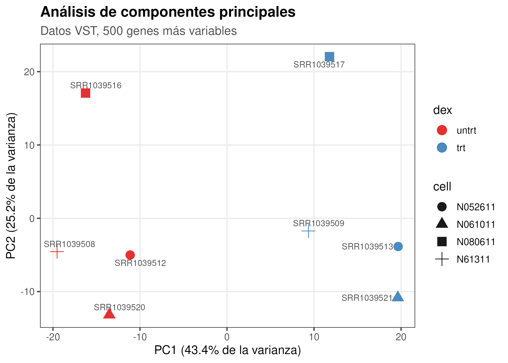
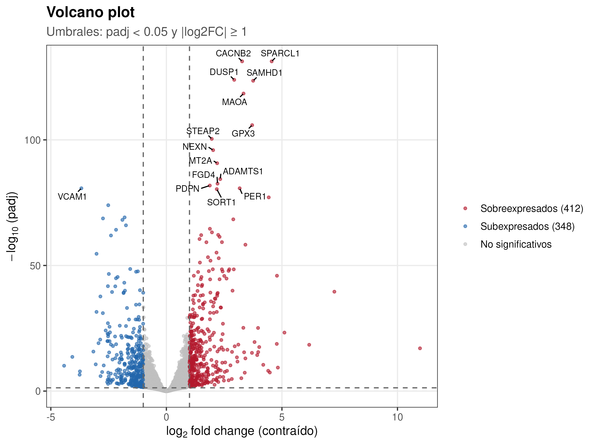
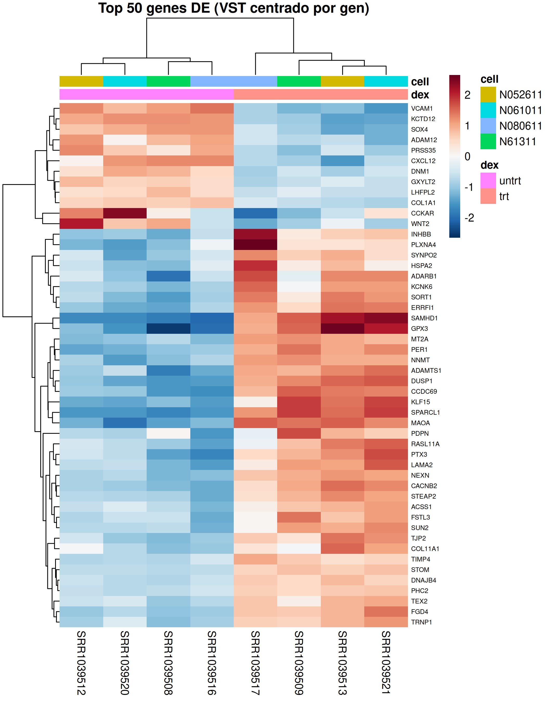
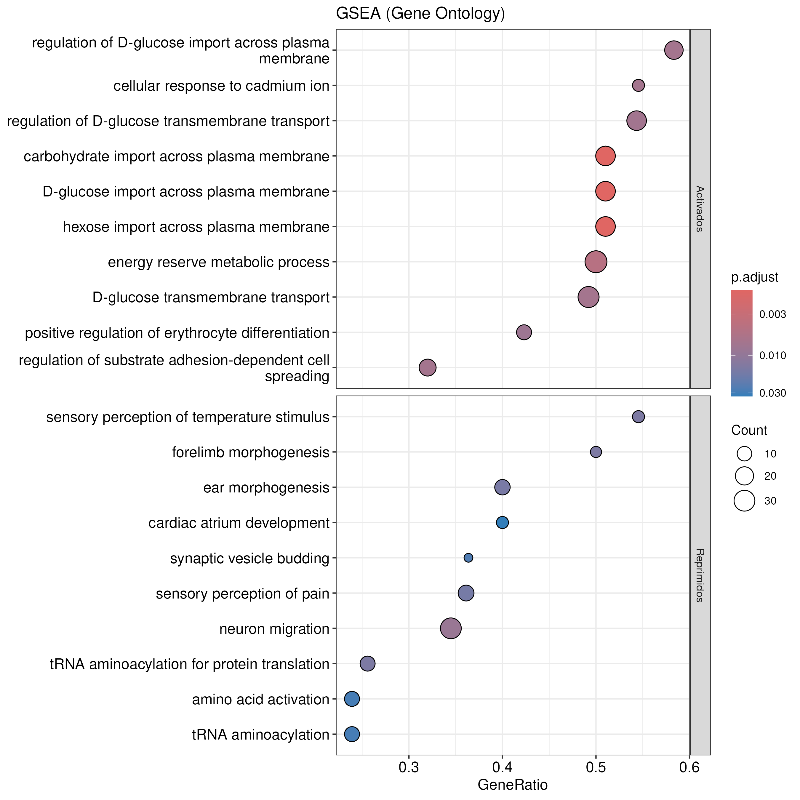
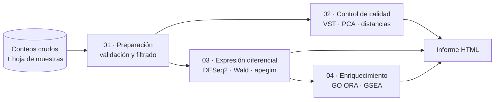

# Análisis de expresión diferencial RNA-seq con DESeq2

[](https://github.com/Daniel-RM-94/rnaseq-deseq2/actions/workflows/ci.yml)
[](https://bioconductor.org/)
[](Dockerfile)
[](LICENSE)

Pipeline reproducible y documentado para el análisis de **expresión génica
diferencial a partir de datos de RNA-seq** con R, Bioconductor y
[DESeq2](https://bioconductor.org/packages/DESeq2/), empaquetado en Docker.

Como caso de estudio, se analiza la **respuesta transcriptómica a la
dexametasona en células de músculo liso de vía aérea humana**
([Himes et al. 2014](https://doi.org/10.1371/journal.pone.0099625)). El mismo
pipeline puede aplicarse a datos propios cambiando únicamente el archivo de
configuración.

---

## Contenido

- [Características](#características)
- [Resultados destacados](#resultados-destacados)
- [Flujo de trabajo](#flujo-de-trabajo)
- [Estructura del repositorio](#estructura-del-repositorio)
- [Inicio rápido](#inicio-rápido)
- [Configuración](#configuración)
- [Usar tus propios datos](#usar-tus-propios-datos)
- [Resultados generados](#resultados-generados)
- [Tests e integración continua](#tests-e-integración-continua)
- [Reproducibilidad](#reproducibilidad)
- [Seguridad](#seguridad)
- [Cómo citar](#cómo-citar)
- [Referencias](#referencias)

## Características

- **Reproducible**: entorno fijado con la imagen oficial de Bioconductor 3.23;
  un solo comando ejecuta todo el análisis.
- **Modular**: pasos independientes (importación → QC → DESeq2 →
  enriquecimiento) y funciones reutilizables en `R/`.
- **Configurable**: diseño experimental, umbrales y rutas centralizados en
  `config/config.yml`, sin tocar el código.
- **Estadísticamente sólido**: diseño pareado, contracción de fold changes con
  `apeglm`, universo de genes adecuado para el ORA y GSEA sin umbrales.
- **Documentado**: informe HTML con interpretación de resultados y
  [documento de metodología](docs/metodologia.md).
- **Probado**: tests unitarios con `testthat` y CI en GitHub Actions, que
  construye la imagen y ejecuta el pipeline completo.
- **Interactivo**: RStudio Server incluido para explorar los datos.

## Resultados destacados

| PCA (control de calidad) | Volcano plot |
|:---:|:---:|
|  |  |
| **Heatmap de los genes DE más significativos** | **GSEA sobre Gene Ontology** |
|  |  |

> Las figuras de esta sección se actualizan automáticamente en `docs/figures/`
> cada vez que se ejecuta el pipeline.

## Flujo de trabajo



| Paso | Script | Descripción |
|------|--------|-------------|
| 1 | `scripts/01_prepare_data.R` | Importa los conteos, valida las entradas, construye el `DESeqDataSet` y filtra los genes poco expresados. |
| 2 | `scripts/02_quality_control.R` | Tamaños de librería, distribuciones, PCA y distancias entre muestras (VST). |
| 3 | `scripts/03_differential_expression.R` | Ajuste del GLM binomial negativo, test de Wald, contracción del LFC con `apeglm`, anotación y figuras. |
| 4 | `scripts/04_functional_enrichment.R` | Enriquecimiento Gene Ontology: ORA de genes sobre/subexpresados y GSEA. |
| — | `scripts/00_run_pipeline.R` | Orquesta todos los pasos, genera el informe y registra las versiones del software. |

## Estructura del repositorio

```
.
├── config/
│   └── config.yml              # Parámetros del análisis (diseño, umbrales, rutas)
├── data/
│   ├── raw/                    # Datos de entrada (no versionados)
│   └── processed/              # Objetos intermedios .rds (no versionados)
├── docker/
│   └── install_packages.R      # Dependencias de R/Bioconductor
├── docs/
│   ├── metodologia.md          # Justificación metodológica y estadística
│   └── figures/                # Figuras mostradas en este README
├── R/                          # Funciones reutilizables
│   ├── utils.R                 #   configuración, logging, E/S
│   ├── de_helpers.R            #   metadatos, filtrado, anotación, resultados
│   ├── enrichment.R            #   ORA y GSEA
│   └── plotting.R              #   figuras
├── reports/
│   └── rnaseq_report.Rmd       # Informe con interpretación de resultados
├── results/                    # Salidas del pipeline (no versionadas)
├── scripts/                    # Pasos del pipeline (00–04)
├── tests/                      # Tests unitarios (testthat)
├── .github/workflows/ci.yml    # Integración continua
├── Dockerfile
├── docker-compose.yml
└── Makefile
```

## Inicio rápido

### Requisitos

- [Docker](https://docs.docker.com/get-docker/) con Docker Compose v2.
- Unos 8 GB de espacio en disco para la imagen y 4 GB de RAM.
- *Opcional*: `make`, para usar los atajos.

No es necesario instalar R ni ningún paquete en el equipo.

### 1. Clonar el repositorio

```bash
git clone https://github.com/Daniel-RM-94/rnaseq-deseq2.git
cd rnaseq-deseq2
```

### 2. Construir la imagen

```bash
docker compose build
```

La primera construcción descarga la imagen de Bioconductor e instala los
paquetes; tarda varios minutos. Las siguientes usan la caché.

### 3. Ejecutar el análisis completo

```bash
docker compose run --rm pipeline
```

Al finalizar, abre el informe en `results/reports/rnaseq_report.html`.

### 4. Explorar interactivamente con RStudio Server

RStudio Server **no tiene contraseña por defecto**. Debes definir la tuya en un
archivo `.env`, que no se versiona.

1. Crea el archivo de entorno a partir de la plantilla:

   ```bash
   cp .env.example .env
   ```

2. Genera una contraseña aleatoria y asígnala a `RSTUDIO_PASSWORD` en `.env`:

   ```bash
   openssl rand -base64 24                     # Linux/macOS
   ```

   ```powershell
   [Convert]::ToBase64String([Security.Cryptography.RandomNumberGenerator]::GetBytes(24))  # Windows
   ```

3. Inicia el servicio:

   ```bash
   docker compose up -d --wait rstudio
   ```

Abre <http://localhost:8787> e inicia sesión con el usuario `rstudio` y la
contraseña definida en `.env`. El proyecto está montado en
`/home/rstudio/project`; abre `rnaseq-deseq2.Rproj` para empezar. Para
detenerlo, ejecuta `docker compose down`.

> Por seguridad, el contenedor **no arranca** si la contraseña está vacía,
> tiene menos de 12 caracteres o es un valor por defecto, o si se intenta
> desactivar la autenticación. El puerto solo es accesible desde tu equipo.
> Los servicios `pipeline` y `tests` no requieren contraseña.

### Atajos con `make`

| Comando | Acción |
|---------|--------|
| `make build` | Construye la imagen |
| `make pipeline` | Ejecuta el análisis completo |
| `make test` | Ejecuta los tests |
| `make rstudio` / `make stop` | Inicia/detiene RStudio Server |
| `make shell` | Abre una terminal en el contenedor |
| `make clean` | Borra los resultados generados |

Cada paso también puede ejecutarse por separado, por ejemplo:
`docker compose run --rm pipeline Rscript scripts/03_differential_expression.R`.

## Configuración

Todo el análisis se controla desde [`config/config.yml`](config/config.yml):

```yaml
design:
  formula: "~ cell + dex"   # la línea celular actúa como covariable de bloqueo
  factor: dex
  reference: untrt
  treatment: trt

de:
  alpha: 0.05               # FDR
  lfc_threshold: 1          # |log2FC| mínimo
  shrinkage: apeglm         # apeglm | normal | none

enrichment:
  run: true
  ontology: BP              # BP | MF | CC
```

## Usar tus propios datos

1. Coloca tu matriz de conteos crudos y tu hoja de muestras en `data/raw/`. El
   formato se detalla en [`data/raw/README.md`](data/raw/README.md).
2. En `config/config.yml`, cambia `input.source` a `files` y ajusta la sección
   `design` a tu experimento.
3. Ejecuta `docker compose run --rm pipeline`.

> El texto interpretativo específico del caso de estudio (secciones sobre
> dexametasona) solo se muestra en el informe cuando `input.source: airway`.

## Resultados generados

| Ruta | Contenido |
|------|-----------|
| `results/reports/rnaseq_report.html` | Informe completo y autocontenido |
| `results/tables/de_results_all.tsv` | Resultados de DESeq2 para todos los genes, anotados |
| `results/tables/de_results_significant.tsv` | Solo los genes diferencialmente expresados |
| `results/tables/go_*.tsv` | Resultados de ORA y GSEA |
| `results/figures/*.png` | Figuras a 300 dpi (QC, DE, enriquecimiento) |
| `results/session_info.txt` | Versiones de R y de los paquetes |

La descripción de cada archivo y columna está en
[`results/README.md`](results/README.md).

## Tests e integración continua

```bash
docker compose run --rm tests
```

Los tests cubren la validación de entradas, la preparación del diseño, el
filtrado, la clasificación de genes DE y el formateo de resultados de DESeq2.

En cada *push* o *pull request*, [GitHub Actions](.github/workflows/ci.yml):

1. construye la imagen Docker (con caché);
2. ejecuta los tests unitarios;
3. ejecuta el pipeline completo;
4. publica `results/` como *artifact* descargable.

## Reproducibilidad

- **Entorno fijado**: la imagen `bioconductor/bioconductor_docker:RELEASE_3_23`,
  fijada por *digest* en el `Dockerfile`, determina versiones compatibles de R
  y de todos los paquetes. La etiqueta se reconstruye periódicamente en origen;
  el *digest* garantiza que todos los builds parten de la misma imagen base.
- **Semilla aleatoria** definida en la configuración.
- **Pasos aislados**: cada script se ejecuta en una sesión de R nueva y solo se
  comunica con los demás a través de archivos.
- **Trazabilidad**: las versiones exactas se registran en
  `results/session_info.txt` y al final del informe.

## Seguridad

- **Sin credenciales en el repositorio.** La contraseña de RStudio Server se
  define en `.env`, que está excluido de git y de la imagen Docker.
- **Validación al arrancar.** RStudio Server no se inicia con una contraseña
  vacía, débil o por defecto.
- **Acceso solo local.** El puerto está enlazado a `127.0.0.1`.

Consulta [`SECURITY.md`](SECURITY.md) para reportar vulnerabilidades y ver la
configuración recomendada del repositorio en GitHub.

## Cómo citar

Si este proyecto te resulta útil, cítalo usando [`CITATION.cff`](CITATION.cff)
(botón *Cite this repository* en GitHub). Cita también las herramientas
utilizadas, en especial DESeq2, apeglm y clusterProfiler.

## Referencias

- Love MI, Huber W, Anders S (2014). Moderated estimation of fold change and dispersion for RNA-seq data with DESeq2. *Genome Biology* 15:550. [doi:10.1186/s13059-014-0550-8](https://doi.org/10.1186/s13059-014-0550-8)
- Zhu A, Ibrahim JG, Love MI (2019). Heavy-tailed prior distributions for sequence count data. *Bioinformatics* 35(12):2084–2092. [doi:10.1093/bioinformatics/bty895](https://doi.org/10.1093/bioinformatics/bty895)
- Himes BE et al. (2014). RNA-Seq transcriptome profiling identifies CRISPLD2 as a glucocorticoid responsive gene that modulates cytokine function in airway smooth muscle cells. *PLoS ONE* 9(6):e99625. [doi:10.1371/journal.pone.0099625](https://doi.org/10.1371/journal.pone.0099625)
- Wu T et al. (2021). clusterProfiler 4.0: A universal enrichment tool for interpreting omics data. *The Innovation* 2(3):100141. [doi:10.1016/j.xinn.2021.100141](https://doi.org/10.1016/j.xinn.2021.100141)
- Guía oficial de Bioconductor: [RNA-seq workflow](https://bioconductor.org/packages/rnaseqGene/).

## Licencia

Distribuido bajo la licencia MIT. Consulta [`LICENSE`](LICENSE).
